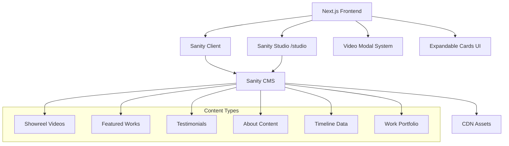
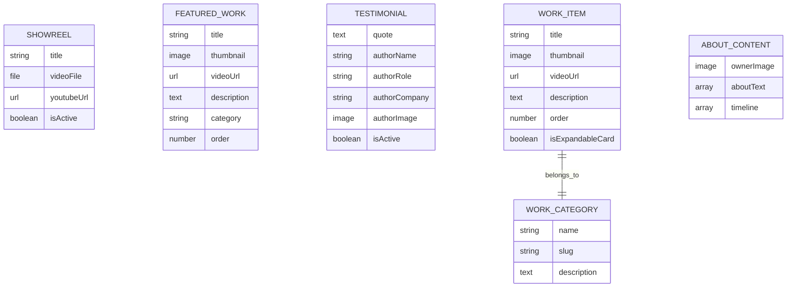

# Design Document

## Overview

This design outlines the transformation of the existing Next.js portfolio website into a fully dynamic, Sanity CMS-powered platform. The solution will integrate Sanity Studio at `/studio`, implement dynamic content fetching for all sections, enhance UI components with video modals, and improve visual layouts. The architecture will support real-time content updates, video management, and enhanced user interactions while maintaining performance and SEO optimization.

## Architecture

### System Architecture



### Technology Stack

- **Frontend**: Next.js 15.5.2 with React 19.1.0
- **CMS**: Sanity CMS with Sanity Studio
- **Styling**: Tailwind CSS with Framer Motion
- **UI Components**: Shadcn/ui + Aceternity UI expandable cards
- **State Management**: React hooks for modal and interaction states
- **Asset Management**: Sanity CDN for images and videos

## Components and Interfaces

### 1. Sanity Studio Integration

**Studio Route Configuration**
- Path: `/studio`
- Conditional navbar rendering based on route
- Embedded Sanity Studio with custom configuration

**Layout Modifications**
```typescript
// app/layout.tsx modifications
export default function RootLayout({ children }: { children: React.ReactNode }) {
  return (
    <html lang="en">
      <body>
        <ConditionalNavbar />
        {children}
      </body>
    </html>
  );
}
```

### 2. Sanity Client Configuration

**Client Setup**
```typescript
// lib/sanity.ts
import { createClient } from '@sanity/client'
import imageUrlBuilder from '@sanity/image-url'

export const client = createClient({
  projectId: process.env.NEXT_PUBLIC_SANITY_PROJECT_ID,
  dataset: process.env.NEXT_PUBLIC_SANITY_DATASET,
  useCdn: true,
  apiVersion: '2024-01-01'
})

const builder = imageUrlBuilder(client)
export const urlFor = (source: any) => builder.image(source)
```

### 3. Content Schema Design

**Showreel Schema**
```typescript
{
  name: 'showreel',
  type: 'document',
  fields: [
    { name: 'title', type: 'string' },
    { name: 'videoFile', type: 'file' },
    { name: 'youtubeUrl', type: 'url' },
    { name: 'isActive', type: 'boolean' }
  ]
}
```

**Featured Work Schema**
```typescript
{
  name: 'featuredWork',
  type: 'document',
  fields: [
    { name: 'title', type: 'string' },
    { name: 'thumbnail', type: 'image' },
    { name: 'videoUrl', type: 'url' },
    { name: 'description', type: 'text' },
    { name: 'category', type: 'string' },
    { name: 'order', type: 'number' }
  ]
}
```

**Testimonials Schema**
```typescript
{
  name: 'testimonial',
  type: 'document',
  fields: [
    { name: 'quote', type: 'text' },
    { name: 'authorName', type: 'string' },
    { name: 'authorRole', type: 'string' },
    { name: 'authorCompany', type: 'string' },
    { name: 'authorImage', type: 'image' },
    { name: 'isActive', type: 'boolean' }
  ]
}
```

**Work Portfolio Schema**
```typescript
{
  name: 'workItem',
  type: 'document',
  fields: [
    { name: 'title', type: 'string' },
    { name: 'thumbnail', type: 'image' },
    { name: 'videoUrl', type: 'url' },
    { name: 'description', type: 'text' },
    { name: 'category', type: 'reference', to: [{ type: 'workCategory' }] },
    { name: 'order', type: 'number' },
    { name: 'isExpandableCard', type: 'boolean' }
  ]
}
```

**About Content Schema**
```typescript
{
  name: 'aboutContent',
  type: 'document',
  fields: [
    { name: 'ownerImage', type: 'image' },
    { name: 'aboutText', type: 'array', of: [{ type: 'block' }] },
    { name: 'timeline', type: 'array', of: [
      {
        type: 'object',
        fields: [
          { name: 'year', type: 'string' },
          { name: 'description', type: 'text' },
          { name: 'image', type: 'image' }
        ]
      }
    ]}
  ]
}
```

### 4. Enhanced UI Components

**Video Modal Component**
```typescript
interface VideoModalProps {
  isOpen: boolean;
  onClose: () => void;
  videoUrl: string;
  title: string;
  description?: string;
}

const VideoModal: React.FC<VideoModalProps> = ({ isOpen, onClose, videoUrl, title, description }) => {
  const modalRef = useRef<HTMLDivElement>(null);
  
  useOutsideClick(modalRef, onClose);
  
  return (
    <AnimatePresence>
      {isOpen && (
        <motion.div className="fixed inset-0 z-50 flex items-center justify-center bg-black/80">
          <motion.div ref={modalRef} className="relative max-w-4xl w-full mx-4">
            {/* Video player and content */}
          </motion.div>
        </motion.div>
      )}
    </AnimatePresence>
  );
};
```

**Enhanced Navbar with IMDB Integration**
```typescript
const NavbarWithIMDB = () => {
  const pathname = usePathname();
  const showNavbar = !pathname.startsWith('/studio');
  
  if (!showNavbar) return null;
  
  return (
    <nav>
      {/* Existing navbar with IMDB logo integration */}
      
    </nav>
  );
};
```

**Expandable Cards Integration**
```typescript
// For Digital Commercials and Film Promo sections
import { ExpandableCardDemo, ExpandableCardDemoGrid } from '@/components/ui/expandable-card';

const DigitalCommercialsSection = ({ items }: { items: WorkItem[] }) => {
  return (
    <section className="w-screen -mx-[50vw] left-1/2 relative">
      <div className="px-4 sm:px-6 lg:px-8">
        <ExpandableCardDemo items={items} />
      </div>
    </section>
  );
};
```

### 5. Data Fetching Strategy

**Server-Side Data Fetching**
```typescript
// lib/queries.ts
export const SHOWREEL_QUERY = `*[_type == "showreel" && isActive == true][0]`;
export const FEATURED_WORKS_QUERY = `*[_type == "featuredWork"] | order(order asc)`;
export const TESTIMONIALS_QUERY = `*[_type == "testimonial" && isActive == true] | order(_createdAt desc)`;
export const WORK_ITEMS_QUERY = `*[_type == "workItem"] | order(category->name asc, order asc)`;
export const ABOUT_CONTENT_QUERY = `*[_type == "aboutContent"][0]`;

// hooks/useSanityData.ts
export const useSanityData = <T>(query: string) => {
  const [data, setData] = useState<T | null>(null);
  const [loading, setLoading] = useState(true);
  const [error, setError] = useState<string | null>(null);
  
  useEffect(() => {
    client.fetch(query)
      .then(setData)
      .catch((err) => setError(err.message))
      .finally(() => setLoading(false));
  }, [query]);
  
  return { data, loading, error };
};
```

## Data Models

### Content Type Relationships



### Layout Improvements

**Featured Section Proportions**
- Transform from stretched layout to square-like aspect ratios
- Implement CSS Grid with `aspect-ratio` property
- Responsive breakpoints for optimal viewing

**Full-Screen Works Section**
- Implement full viewport width using negative margins
- Container breakout technique: `w-screen -mx-[50vw] left-1/2 relative`

## Error Handling

### Content Loading States
```typescript
const ContentSection = ({ query, fallback }: { query: string; fallback: React.ReactNode }) => {
  const { data, loading, error } = useSanityData(query);
  
  if (loading) return <LoadingSpinner />;
  if (error) return <ErrorBoundary error={error} fallback={fallback} />;
  if (!data) return fallback;
  
  return <ContentRenderer data={data} />;
};
```

### Graceful Degradation
- Static fallback content when Sanity is unavailable
- Progressive enhancement for video features
- Offline-first approach for critical content

## Testing Strategy

### Unit Testing
- Component rendering with mock Sanity data
- Hook functionality for data fetching
- Modal interactions and outside click behavior

### Integration Testing
- Sanity client configuration and queries
- Video modal functionality across different content types
- Responsive layout behavior

### End-to-End Testing
- Complete user journeys from homepage to works
- Studio access and content management workflows
- Video playback and modal interactions

### Performance Testing
- Image optimization and lazy loading
- Video streaming performance
- Bundle size analysis with Sanity integration

## Security Considerations

### Content Security Policy
```typescript
// next.config.ts
const nextConfig = {
  async headers() {
    return [
      {
        source: '/(.*)',
        headers: [
          {
            key: 'Content-Security-Policy',
            value: "frame-src 'self' https://www.youtube.com https://*.sanity.io;"
          }
        ]
      }
    ];
  }
};
```

### Environment Variables
- Sanity project credentials in environment variables
- Public vs private API tokens
- Studio authentication configuration

## Performance Optimization

### Image Optimization
- Sanity CDN integration with Next.js Image component
- Responsive image serving based on device capabilities
- WebP format support with fallbacks

### Video Loading Strategy
- Lazy loading for video thumbnails
- Progressive video loading in modals
- YouTube embed optimization for showreel

### Code Splitting
- Dynamic imports for Sanity Studio
- Lazy loading of expandable card components
- Route-based code splitting for studio path